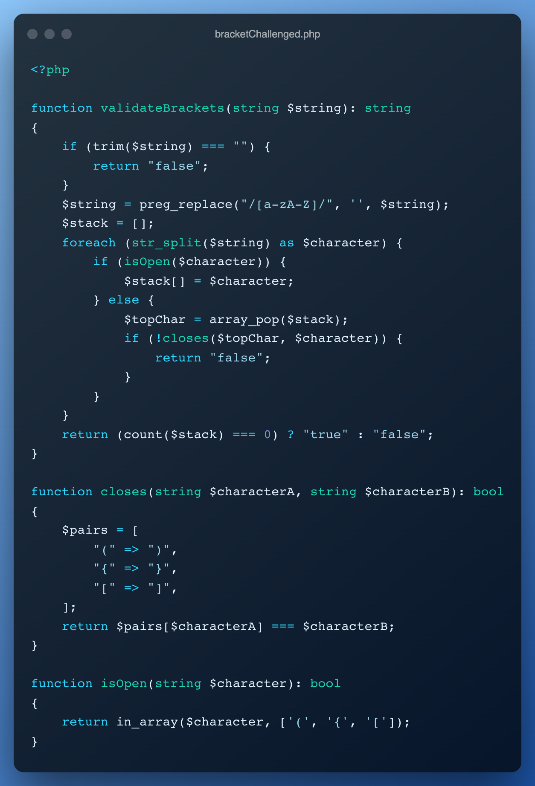

# bracketChallenged
Validación de cierres de paréntesis, corchetes y llaves de un string en específico.

```php
<?php
    $case1 = "(())"; // => true
    $case2 = "({()()}[()])"; // => true
    $case3 = "{[}()]"; // => false
    $case4 = "({(fgfgfgfgfg)(dfgdfgdfgdf)}[dfgdfg(dfgdfgdfgdfg)]dfgdfgdfgdfg)"; // => true
    $case5 = ""; // => false
```

Para probar el Script, se debe ejecutar en su máquina la siguiente instrucción:
```bash
root@ad19995e99f2:/usr/src/app# php bracketChallenged.php
**********************************
*     Resultado de la prueba     *
**********************************
Case 1: [(())] => true
Case 2: [({()()}[()])] => true
Case 3: [{[}()]] => false
Case 4: [({(fgfgfgfgfg)(dfgdfgdfgdf)}[dfgdfg(dfgdfgdfgdfg)]dfgdfgdfgdfg)] => true
Case 5: [] => false
```

## **Resultado de la función creada:**
